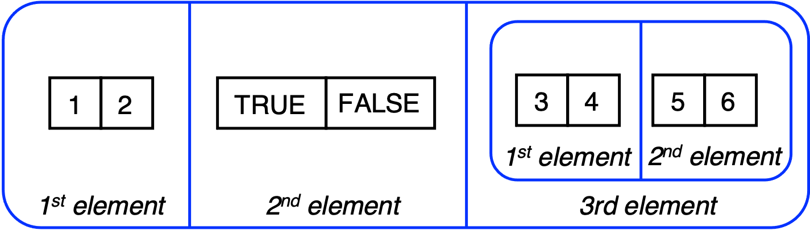

In R there are two types of vectors: **atomic vectors**, where all the data must be of the same type, and **lists**, which are more flexible and each element's type can vary.


### Atomic vectors

An atomic vector is a one-dimensional data structure that allows you to store one or more values. There are four main types of data that can be stored in an atomic vector: integer, logical, double, and character. 

Here are some examples. We use the function `c()` to create an atomic vector. The function `typeof()` shows a vector's type, while `str()` is useful to indicate the vectors structure.


* First, we look at a logical vector. Here, values can be `TRUE` or `FALSE`
```{r}

# Create and display a logical vector
x_logi <- c(TRUE, T, FALSE, TRUE, F)
x_logi

typeof(x_logi)

str(x_logi)

is.logical(x_logi)
```

* Second, we look at an integer vector

```{r}

# Create and display an integer vector
x_int <- c(2L, 4L, 6L, 8L, 10L)
x_int

typeof(x_int)

str(x_int)

is.integer(x_int)


```

* Third, we explore the double type.

```{r}
# Create and display a double vector
x_dbl<- c(1.2, 3.4, 7.2, 11.1, 12.7)
x_dbl

typeof(x_dbl)

str(x_dbl)

is.double(x_dbl)

```

* Finally, we introduce the character vector.


```{r}
# Create and display a character vector
x_chr<- c("One","Two","Three","Four","Five")
x_chr

typeof(x_chr)

str(x_chr)

is.character(x_chr)

```


### Lists

A list is a vector that can contain different types, including a list. It  can be defined using the `list()` function, which is similar to the `c()` function used to create atomic vectors. Here is an example of defining a list.

```{r}
# Create a list
l1 <- list(1:2,c(TRUE, FALSE),list(3:4,5:6))
# Display the list.
l1
# Show the list type
typeof(l1)
# Summarize the list structure 
str(l1)
# Confirm the number of elements
length(l1)
```

The variable `l1` is a list, and it contains three elements:

* An atomic vector of two integers, as defined by the command `1:2`.
* An atomic vector of two logicals, defined by `c(TRUE, FALSE)`. 
* A list containing two elements, both integer atomic vectors, the first defined by `3:4`, and the second defined by `5:6`. 


The list `l1` is visualized below as a rounded rectangle, and we can clearly see that it has three elements. 

```{r, ch02-list, fig.cap='Visualizing a list of three elements',echo=FALSE}

```


