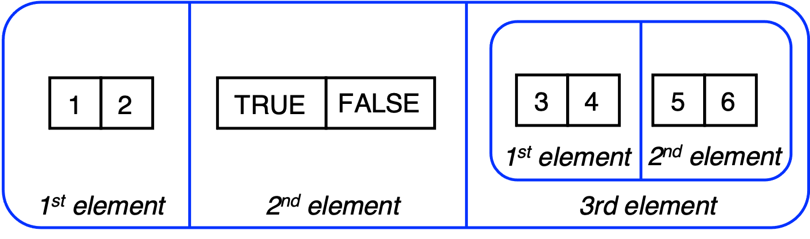

Chapter 2 Examples - Vectors
================

In R there are two types of vectors: **atomic vectors**, where all the
data must be of the same type, and **lists**, which are more flexible
and each element’s type can vary.

### Atomic vectors

An atomic vector is a one-dimensional data structure that allows you to
store one or more values. There are four main types of data that can be
stored in an atomic vector: integer, logical, double, and character.

Here are some examples. We use the function `c()` to create an atomic
vector. The function `typeof()` shows a vector’s type, while `str()` is
useful to indicate the vectors structure.

- First, we look at a logical vector. Here, values can be `TRUE` or
  `FALSE`

``` r
# Create and display a logical vector
x_logi <- c(TRUE, T, FALSE, TRUE, F)
x_logi
```

    ## [1]  TRUE  TRUE FALSE  TRUE FALSE

``` r
typeof(x_logi)
```

    ## [1] "logical"

``` r
str(x_logi)
```

    ##  logi [1:5] TRUE TRUE FALSE TRUE FALSE

``` r
is.logical(x_logi)
```

    ## [1] TRUE

- Second, we look at an integer vector

``` r
# Create and display an integer vector
x_int <- c(2L, 4L, 6L, 8L, 10L)
x_int
```

    ## [1]  2  4  6  8 10

``` r
typeof(x_int)
```

    ## [1] "integer"

``` r
str(x_int)
```

    ##  int [1:5] 2 4 6 8 10

``` r
is.integer(x_int)
```

    ## [1] TRUE

- Third, we explore the double type.

``` r
# Create and display a double vector
x_dbl<- c(1.2, 3.4, 7.2, 11.1, 12.7)
x_dbl
```

    ## [1]  1.2  3.4  7.2 11.1 12.7

``` r
typeof(x_dbl)
```

    ## [1] "double"

``` r
str(x_dbl)
```

    ##  num [1:5] 1.2 3.4 7.2 11.1 12.7

``` r
is.double(x_dbl)
```

    ## [1] TRUE

- Finally, we introduce the character vector.

``` r
# Create and display a character vector
x_chr<- c("One","Two","Three","Four","Five")
x_chr
```

    ## [1] "One"   "Two"   "Three" "Four"  "Five"

``` r
typeof(x_chr)
```

    ## [1] "character"

``` r
str(x_chr)
```

    ##  chr [1:5] "One" "Two" "Three" "Four" "Five"

``` r
is.character(x_chr)
```

    ## [1] TRUE

### Lists

A list is a vector that can contain different types, including a list.
It can be defined using the `list()` function, which is similar to the
`c()` function used to create atomic vectors. Here is an example of
defining a list.

``` r
# Create a list
l1 <- list(1:2,c(TRUE, FALSE),list(3:4,5:6))
# Display the list.
l1
```

    ## [[1]]
    ## [1] 1 2
    ## 
    ## [[2]]
    ## [1]  TRUE FALSE
    ## 
    ## [[3]]
    ## [[3]][[1]]
    ## [1] 3 4
    ## 
    ## [[3]][[2]]
    ## [1] 5 6

``` r
# Show the list type
typeof(l1)
```

    ## [1] "list"

``` r
# Summarize the list structure 
str(l1)
```

    ## List of 3
    ##  $ : int [1:2] 1 2
    ##  $ : logi [1:2] TRUE FALSE
    ##  $ :List of 2
    ##   ..$ : int [1:2] 3 4
    ##   ..$ : int [1:2] 5 6

``` r
# Confirm the number of elements
length(l1)
```

    ## [1] 3

The variable `l1` is a list, and it contains three elements:

- An atomic vector of two integers, as defined by the command `1:2`.
- An atomic vector of two logicals, defined by `c(TRUE, FALSE)`.
- A list containing two elements, both integer atomic vectors, the first
  defined by `3:4`, and the second defined by `5:6`.

The list `l1` is visualized below as a rounded rectangle.

<figure>

<figcaption aria-hidden="true">Visualizing a list of three
elements</figcaption>
</figure>
