Chapter 7 Examples - Visualization with ggplot2
================

### Exploring relationships with a scatterplot

Creating a scatterplot to explore the relationship between two numeric
variables is a convenient way to start our exploration of `ggplot2`

We include the library `ggplot2`, and will focus on the tibble `mpg`.

``` r
library(ggplot2)
mpg
```

    ## # A tibble: 234 × 11
    ##    manufacturer model      displ  year   cyl trans drv     cty   hwy fl    class
    ##    <chr>        <chr>      <dbl> <int> <int> <chr> <chr> <int> <int> <chr> <chr>
    ##  1 audi         a4           1.8  1999     4 auto… f        18    29 p     comp…
    ##  2 audi         a4           1.8  1999     4 manu… f        21    29 p     comp…
    ##  3 audi         a4           2    2008     4 manu… f        20    31 p     comp…
    ##  4 audi         a4           2    2008     4 auto… f        21    30 p     comp…
    ##  5 audi         a4           2.8  1999     6 auto… f        16    26 p     comp…
    ##  6 audi         a4           2.8  1999     6 manu… f        18    26 p     comp…
    ##  7 audi         a4           3.1  2008     6 auto… f        18    27 p     comp…
    ##  8 audi         a4 quattro   1.8  1999     4 manu… 4        18    26 p     comp…
    ##  9 audi         a4 quattro   1.8  1999     4 auto… 4        16    25 p     comp…
    ## 10 audi         a4 quattro   2    2008     4 manu… 4        20    28 p     comp…
    ## # ℹ 224 more rows

``` r
ggplot(data=mpg, mapping=aes(x=displ,y=cty)) +
  geom_point()
```

<figure>
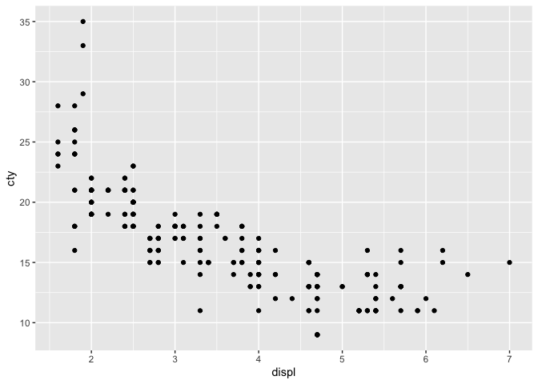
<figcaption aria-hidden="true">Plotting displacement v city miles per
gallon</figcaption>
</figure>

We can set the `aes()` argument `color` to the particular variable we
would like to color the plot by.

``` r
ggplot(data=mpg,mapping=aes(x=displ,y=cty,color=class))+
  geom_point()
```

<figure>
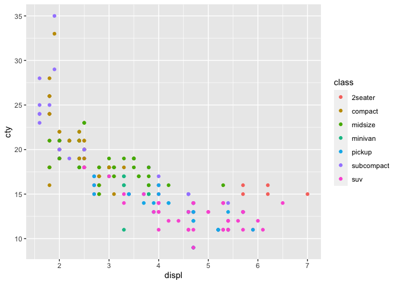
<figcaption aria-hidden="true">Coloring the points by the class
variable</figcaption>
</figure>

Plots can be stored in a variable, and then added to using the `+`
operator. Here the function `labs()` can be used to organise plot
information.

``` r
p1 <- ggplot(data=mpg,aes(x=displ,y=hwy,size=cyl,color=class))+
        geom_point()

p1 <- p1 + 
       labs(
         title = "Exploring automobile relationships",
         subtitle = "Displacement v Highway Miles Per Gallon",
         color = "Class of Car",
         size = "Cylinder Size",
         caption = "Sample chart using the lab() function",
         tag = "Plot #1",
         x = "Displacement (Litres)",
         y = "Highway Miles Per Gallon"
       )

p1
```

<figure>
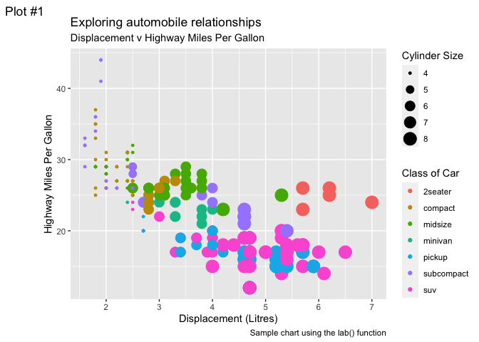
<figcaption aria-hidden="true">Configuring the plot using the labs()
function</figcaption>
</figure>

### Subplots with facets

Plots can be divided into subplots using `facet_wrap()`.

``` r
ggplot(data=mpg,aes(x=displ,y=cty))+
  geom_point()+
  facet_wrap(~class)
```

<figure>
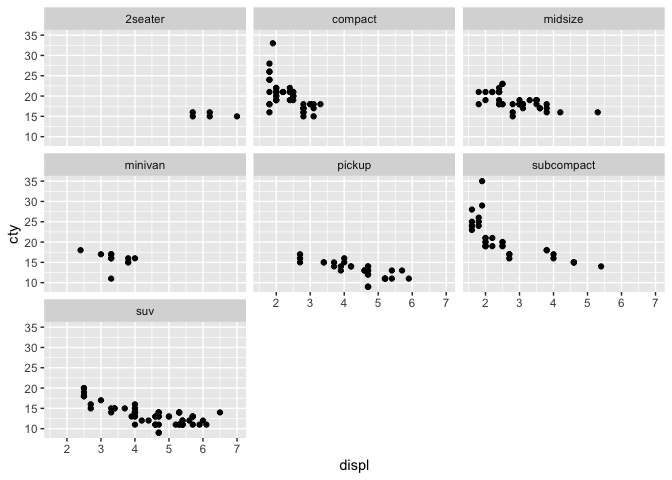
<figcaption aria-hidden="true">Using facets to sub-divide
plots</figcaption>
</figure>

A 2D grid can also be arranged for subplots. Here the rows are the
variable `class`, while the columns are the variable `drv`.

``` r
ggplot(data=mpg,mapping = aes(x=displ,y=cty))+
  geom_point()+
  facet_grid(class~drv)
```

<figure>
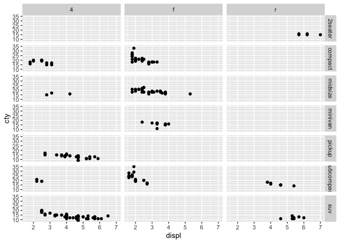
<figcaption aria-hidden="true">Generating a grid of plots</figcaption>
</figure>

### Statistical transformations

Here we show a bar chart.

``` r
ggplot(data=diamonds,mapping=aes(x=cut))+
  geom_bar()
```

<figure>
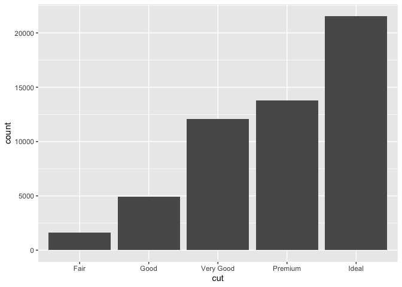
<figcaption aria-hidden="true">A bar chart show frequency counts of
diamond cuts</figcaption>
</figure>

And now, we draw a histogram using `geom_histogram()`

``` r
ggplot(data=diamonds,mapping=aes(x=price))+
  geom_histogram(bins = 15)
```

<figure>
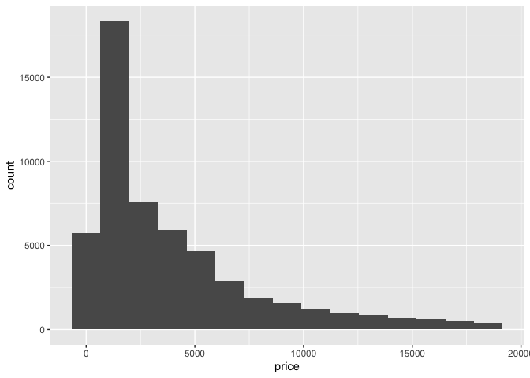
<figcaption aria-hidden="true">Display the price histogram for all
diamonds</figcaption>
</figure>

Boxplots are useful representations of continuous data.

``` r
ggplot(data=mpg,mapping=aes(y=cty,x=class))+
  geom_boxplot()
```

<figure>
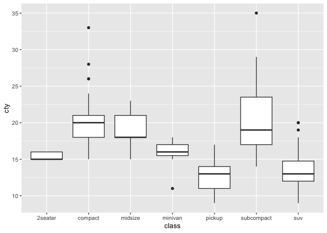
<figcaption aria-hidden="true">Highlighting continuous variables using a
boxplot</figcaption>
</figure>

### Covariation with `ggpairs()`

It is useful to visualize associations between variables.

``` r
library(GGally)
my_vars <- subset(mpg,select=c(cty,hwy,displ))
ggpairs(my_vars)
```

<figure>
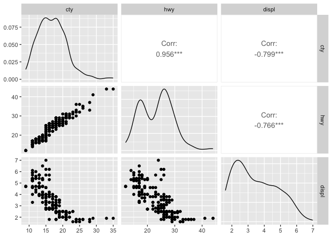
<figcaption aria-hidden="true">Visualising possible associations between
three variables</figcaption>
</figure>

### Themes with `ggplot2`

We can use different themese when displaying plots.

``` r
p1 <- ggplot(mpg,aes(x=displ,y=cty,colour=class)) + geom_point()

p1 + theme_bw() + ggtitle("theme_bw()")
```

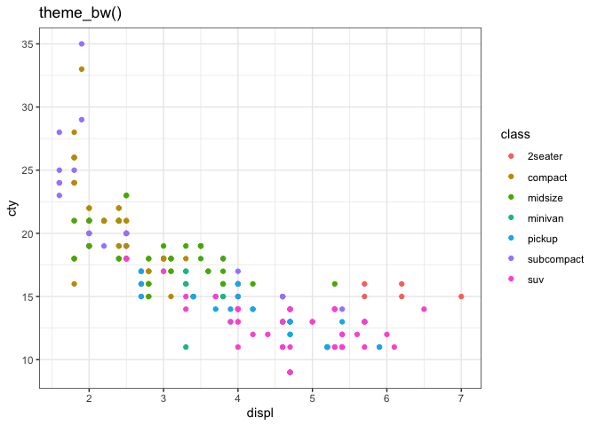<!-- -->

``` r
p1 + theme_light() + ggtitle("theme_light()")
```

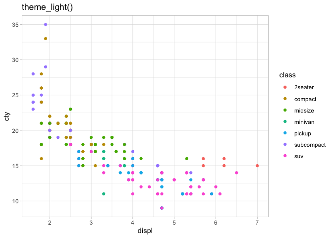<!-- -->

``` r
p1 + theme_dark()+ ggtitle("theme_dark()")
```

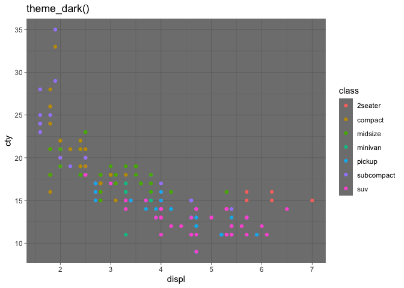<!-- -->

``` r
p1 + theme_minimal()+ ggtitle("theme_minimal()")
```

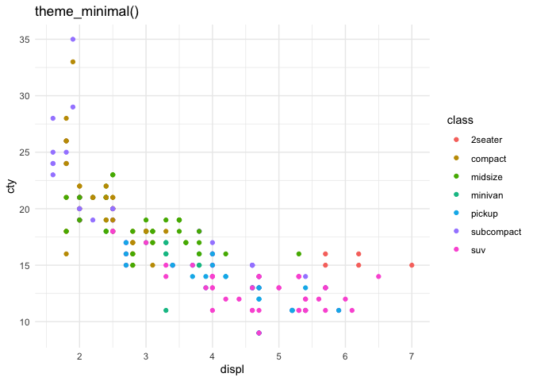<!-- -->

``` r
p1 + theme_classic() + ggtitle("theme_classic()")
```

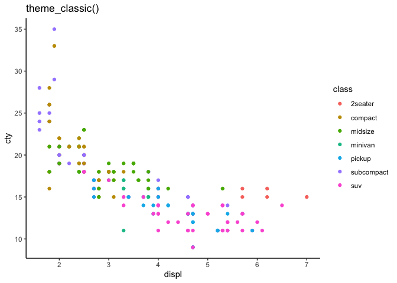<!-- -->

``` r
p1 + theme_void() + ggtitle("theme_void()")
```

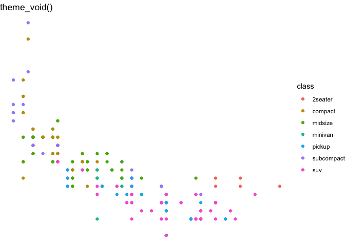<!-- -->
